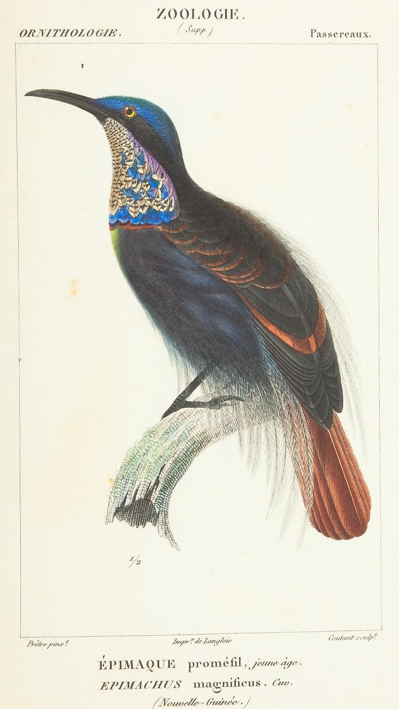
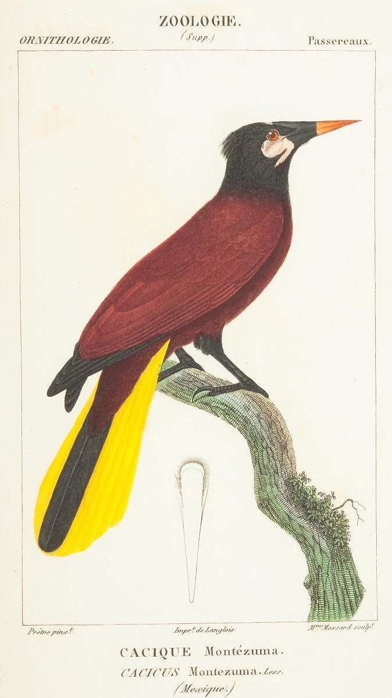
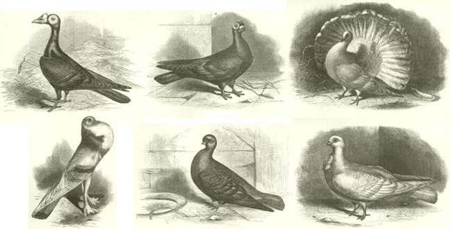
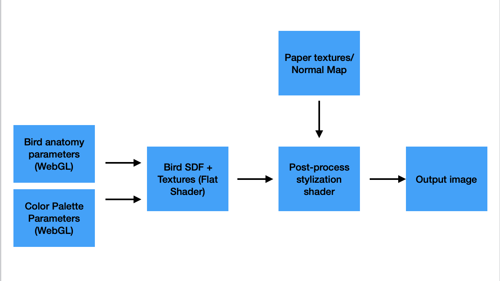
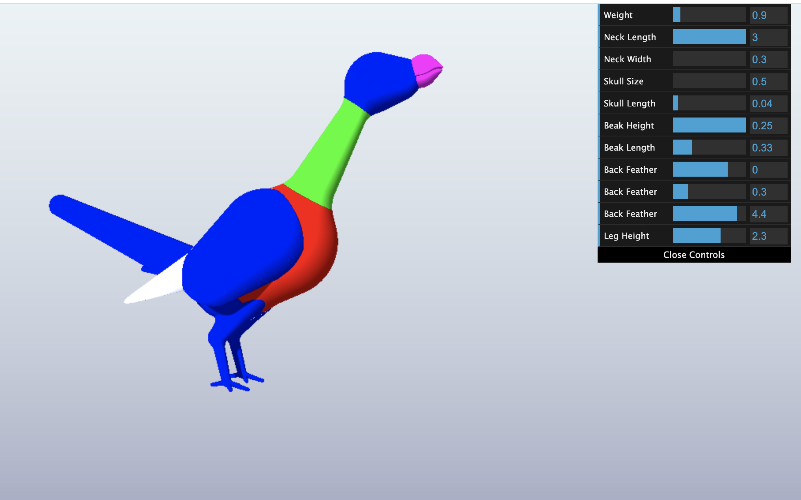
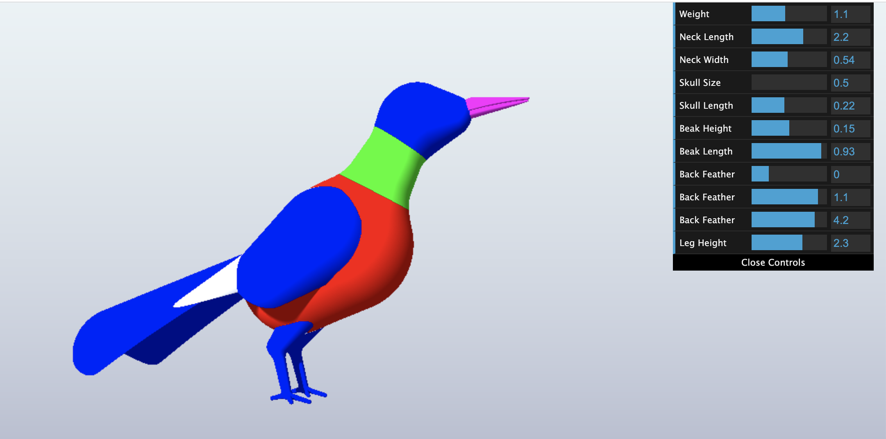
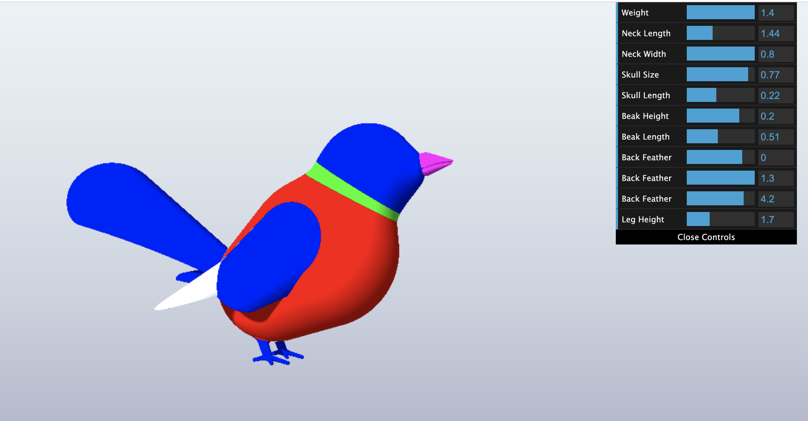
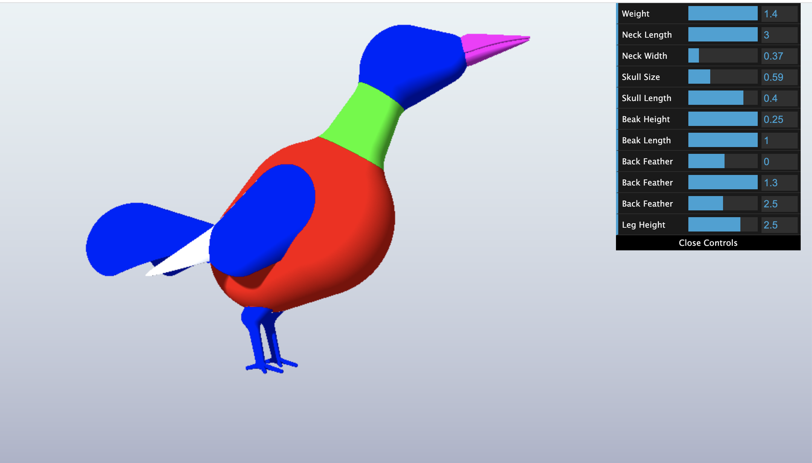

# Final Project!

This is it! The culmination of your procedural graphics experience this semester. For your final project, we'd like to give you the time and space to explore a topic of your choosing. You may choose any topic you please, so long as you vet the topic and scope with an instructor or TA. We've provided some suggestions below. The scope of your project should be roughly 1.5 homework assignments). To help structure your time, we're breaking down the project into 4 milestones:

## Milestone 1: Project planning (due 11/15)
Before submitting your first milestone, _you must get your project idea and scope approved by Rachel, Adam or a TA._

### Design Doc
Start off by forking this repository. In your README, write a design doc to outline your project goals and implementation plan. It must include the following sections:

#### Introduction
For this project, I will create a WebGL-based procedural bird generator that mimics the style of scientific illustrations. This will be based on an SDF generator connected to a post-process shader pipeline. Users will be able to modify the bird's anatomy and colors using various dat.GUI parameters.

#### Goal
My goal is to build a parameterized and highly stylized toy that incorporates  2D and 3D SDF modeling along with NPR stylizations for crosshatching and painterly rendering.

#### Inspiration/reference:

#### Specification:
- Bird SDF Generator: A bird model constructed using SDF modeling. This will be structured based on a scene graph. Different aspects of the bird (such as beak size/shape, wing size, etc.) will be editable through the WebGL GUI.

- Procedural bird textures: These will be generated using noise and 2D SDFs, then projected onto the bird SDF model. Users will be able to control the bird's color palette through the WebGL GUI as well.

- Scientific illustration shading model: A combination of cross hatching, edge detection, and painterly rendering filters. These will all be done in a single GLSL post-process shader and layered on top of one another. For painterly rendering, I will adapt the shading model from the paper Art-directed watercolor stylization of 3D animations in real-time, by Montesdeoca et al, which I previously worked with in my Senior Design project last year.

#### Techniques:
- Cross Hatching using Tonal Art Maps: https://citeseerx.ist.psu.edu/viewdoc/download?doi=10.1.1.9.5039&rep=rep1&type=pdf

- Cross Hatching in a shader: https://www.shadertoy.com/view/MsKfRw

- Watercolor shading model: https://artineering.io/publications/Art-Directed-Watercolor-Stylization-of-3D-Animations-in-Real-Time/

#### Design:

#### Timeline:
- Week 1: Implement base WebGL pipeline that allows buffers to be passed properly between SDF flat shader, post process shader, and final output buffer. Create base SDF bird model with flat shading and noise-based textures.

- Week 2: Complete scientific illustration model with cross hatching and painterly shading. Continue refining bird model, refine lighting, and create 2D SDF textures.

- Week 3: Refine bird scene and post process shaders. Add background/polish elements such as tree trunk and shadowed floor.

Submit your Design doc as usual via pull request against this repository.
## Milestone 2: Implementation part 1 (due 11/22)
Begin implementing your engine! Don't worry too much about polish or parameter tuning -- this week is about getting together the bulk of your generator implemented. By the end of the week, even if your visuals are crude, the majority of your generator's functionality should be done.

Put all your code in your forked repository.

Submission: Add a new section to your README titled: Milestone #1, which should include
- written description of progress on your project goals. If you haven't hit all your goals, what's giving you trouble?
- Examples of your generators output so far
We'll check your repository for updates. No need to create a new pull request.

#### Progress:

- Implemented WebGL pipeline with post process shader (currently a no operation passthrough).

- Modeled basic bird anatomy with SDFs.

- Added several parameters for bird generation, such as weight, skull size, and beak size.

#### Output Examples:

## Milestone 3: Implementation part 2 (due 11/29)
We're over halfway there! This week should be about fixing bugs and extending the core of your generator. Make sure by the end of this week _your generator works and is feature complete._ Any core engine features that don't make it in this week should be cut! Don't worry if you haven't managed to exactly hit your goals. We're more interested in seeing proof of your development effort than knowing your planned everything perfectly.

Put all your code in your forked repository.

Submission: Add a new section to your README titled: Milestone #3, which should include
- written description of progress on your project goals. If you haven't hit all your goals, what did you have to cut and why?
- Detailed output from your generator, images, video, etc.
We'll check your repository for updates. No need to create a new pull request.

Come to class on the due date with a WORKING COPY of your project. We'll be spending time in class critiquing and reviewing your work so far.

## Final submission (due 12/6)
Time to polish! Spen this last week of your project using your generator to produce beautiful output. Add textures, tune parameters, play with colors, play with camera animation. Take the feedback from class critques and use it to take your project to the next level.

Submission:
- Push all your code / files to your repository
- Come to class ready to present your finished project
- Update your README with two sections
  - final results with images and a live demo if possible
  - post mortem: how did your project go overall? Did you accomplish your goals? Did you have to pivot?

## Topic Suggestions

### Create a generator in Houdini

### A CLASSIC 4K DEMO
- In the spirit of the demo scene, create an animation that fits into a 4k executable that runs in real-time. Feel free to take inspiration from the many existing demos. Focus on efficiency and elegance in your implementation.
- Example:
  - [cdak by Quite & orange](https://www.youtube.com/watch?v=RCh3Q08HMfs&list=PLA5E2FF8E143DA58C)

### A RE-IMPLEMENTATION
- Take an academic paper or other pre-existing project and implement it, or a portion of it.
- Examples:
  - [2D Wavefunction Collapse Pokémon Town](https://gurtd.github.io/566-final-project/)
  - [3D Wavefunction Collapse Dungeon Generator](https://github.com/whaoran0718/3dDungeonGeneration)
  - [Reaction Diffusion](https://github.com/charlesliwang/Reaction-Diffusion)
  - [WebGL Erosion](https://github.com/LanLou123/Webgl-Erosion)
  - [Particle Waterfall](https://github.com/chloele33/particle-waterfall)
  - [Voxelized Bread](https://github.com/ChiantiYZY/566-final)

### A FORGERY
Taking inspiration from a particular natural phenomenon or distinctive set of visuals, implement a detailed, procedural recreation of that aesthetic. This includes modeling, texturing and object placement within your scene. Does not need to be real-time. Focus on detail and visual accuracy in your implementation.
- Examples:
  - [The Shrines](https://github.com/byumjin/The-Shrines)
  - [Watercolor Shader](https://github.com/gracelgilbert/watercolor-stylization)
  - [Sunset Beach](https://github.com/HanmingZhang/homework-final)
  - [Sky Whales](https://github.com/WanruZhao/CIS566FinalProject)
  - [Snail](https://www.shadertoy.com/view/ld3Gz2)
  - [Journey](https://www.shadertoy.com/view/ldlcRf)
  - [Big Hero 6 Wormhole](https://2.bp.blogspot.com/-R-6AN2cWjwg/VTyIzIQSQfI/AAAAAAAABLA/GC0yzzz4wHw/s1600/big-hero-6-disneyscreencaps.com-10092.jpg)

### A GAME LEVEL
- Like generations of game makers before us, create a game which generates an navigable environment (eg. a roguelike dungeon, platforms) and some sort of goal or conflict (eg. enemy agents to avoid or items to collect). Aim to create an experience that will challenge players and vary noticeably in different playthroughs, whether that means procedural dungeon generation, careful resource management or an interesting AI model. Focus on designing a system that is capable of generating complex challenges and goals.
- Examples:
  - [Rhythm-based Mario Platformer](https://github.com/sgalban/platformer-gen-2D)
  - [Pokémon Ice Puzzle Generator](https://github.com/jwang5675/Ice-Puzzle-Generator)
  - [Abstract Exploratory Game](https://github.com/MauKMu/procedural-final-project)
  - [Tiny Wings](https://github.com/irovira/TinyWings)
  - Spore
  - Dwarf Fortress
  - Minecraft
  - Rogue

### AN ANIMATED ENVIRONMENT / MUSIC VISUALIZER
- Create an environment full of interactive procedural animation. The goal of this project is to create an environment that feels responsive and alive. Whether or not animations are musically-driven, sound should be an important component. Focus on user interactions, motion design and experimental interfaces.
- Examples:
  - [The Darkside](https://github.com/morganherrmann/thedarkside)
  - [Music Visualizer](https://yuruwang.github.io/MusicVisualizer/)
  - [Abstract Mesh Animation](https://github.com/mgriley/cis566_finalproj)
  - [Panoramical](https://www.youtube.com/watch?v=gBTTMNFXHTk)
  - [Bound](https://www.youtube.com/watch?v=aE37l6RvF-c)

### YOUR OWN PROPOSAL
- You are of course welcome to propose your own topic . Regardless of what you choose, you and your team must research your topic and relevant techniques and come up with a detailed plan of execution. You will meet with some subset of the procedural staff before starting implementation for approval.
